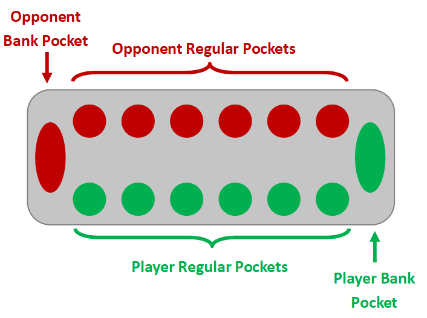
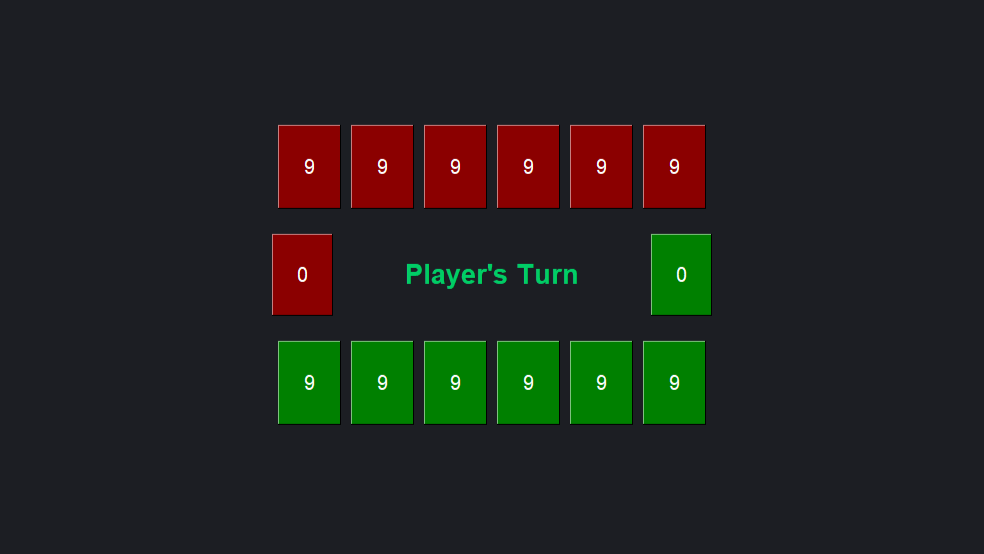
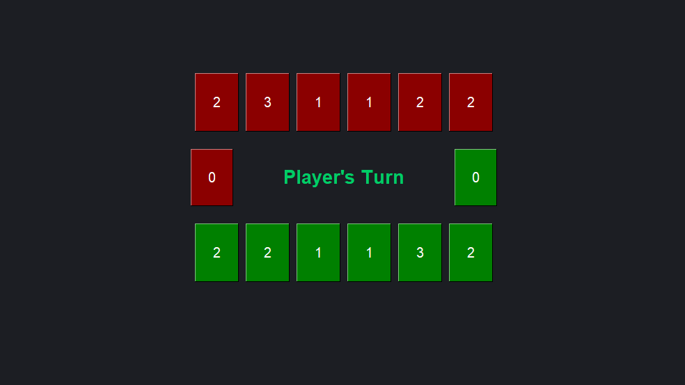

# Mancala
Player vs. Computer Mancala Game

## How To Play
*This version of Mancala is the same as "Capture Mode" played in Game Pigeon.*

### Overview
* The Mancala board consists of 14 pockets (2 bank pockets, 12 regular pockets).
* Each player has 1 bank pocket and 6 regular pocks with a starting amount of points in each regular pocket.
* The goal of Mancala is to end the game with more points in your bank than your opponent's bank.

### Gameplay
* At the start of your turn, you choose a pocket to move points from.
* The amount of points in the chosen pocket correspond to the number of pockets you deposit a point in going around the board counter-clockwise.
  * You do not deposit a point into the opponent's bank pocket.
  * If you end your turn in your own bank pocket, then you earn an extra turn.
  * If you end in one of your own regular pockets that has no points and the corresponding opponent's pocket has points, all points in your current pocket and the corresponding opponent's pocket is deposited into your bank.
* If you or the opponent end the turn with no points in any of the regular pockets of one side, the rest of the points left in the regular pockets are deposited into the bank of the same side.
 
 

## Game Modes
### Normal
The Normal game mode means that all regular pockets start with 4 points.

### Long
The Long game mode means that all regular pockets start with 9 points.

### Random
The Random game mode means that all regular pockets each start with a random amount of points mirrored on both sides (to be fair).

 
 

## Computer Logic
The computer was not designed to be mathematically perfect with the game. Instead, it was built to follow a list of priorities when determining its next move.  
**Computer Logic Priority:** 
1. Looks for move that would earn extra turn.
2. Looks for move that would capture Player's points.
3. Looks for move that prevents Player from capturing its points.
4. Moves random pocket.
 
 

## Libraries In Use 
### main.py
* PySimpleGUI

### mancala.py
* random

### mancalaGame.py
* sys
* os
* PySimpleGUI
* threading
* time
* pygame
* mancala
* coloramaW

 

## How To Run Program
Run "*python main.py*" in the command line.
 
(There is also some helpful debugging text/extra info that is printed to the command line.)